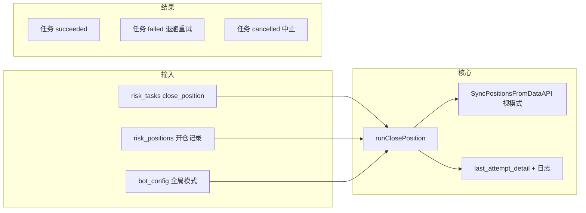

# 风控平仓执行：三种全局模式

本文描述 Polybet **全局唯一**的平仓执行策略（`bot_config`），适用于：

- 移动止损自动入队的 `close_position`（`reason=stop_loss`）
- 风控页手动「卖出」
- 「一键平仓」产生的每个子 `close_position`（`reason` 可为空）

**单一执行入口**：服务端仅在 [`runClosePosition`](../server/internal/service/risksvc/risksvc.go) 内根据当前配置选择分支；**不得**在其它模块重复实现一套 CLOB 下单。

---

## 1. 配置项（全局）

| 键 | 含义 | 合法值 / 默认 |
|----|------|----------------|
| `riskCloseExecutionMode` | 执行模式 | `fok_sell`（默认）\| `fak_sell` \| `hedge_fok_buy` |
| `riskCloseFakWorstPrice` | FAK 卖单的 worst-price（滑点边界） | 默认 `0.01`（0–1 概率价，受市场 tick 约束） |
| `riskHedgeBuySizing` | 对冲买单规模（仅 `hedge_fok_buy`） | `notional` \| `shares` |
| `riskHedgeAutoHidePosition`（可选） | 对冲成功后是否自动「不再监控」原持仓 | 建议默认 `true`，避免对同一 YES 反复触发止损 |

用户在 **Dashboard 设置页** 选择模式并保存后，**之后**所有平仓任务在执行时读取最新配置（无需单独重启逻辑，每次 `runClosePosition` 读库即可）。

---

## 2. 整体流程（三种模式共用骨架）

1. **任务调度**：`ProcessRiskTasksOnce` 取出到期的 `close_position`，`SetRiskTaskRunning` 后调用 `runClosePosition`。
2. **读配置**：读取 `riskCloseExecutionMode` 及附属键。
3. **前置校验**：`evaluateCloseTaskAbort`（无持仓、隐藏、市场已结束等）与今日一致；**对冲**另需解析「对手 token」。
4. **置 `closing`**：与现逻辑一致，失败时回滚 `open`。
5. **执行 CLOB**：按模式分支（见下三节）。
6. **对账**：至少对 **FAK 卖**、**对冲买** 在下单后调用 `SyncPositionsFromDataAPI`，再读 `GetRiskPosition`。
7. **收尾**：更新 `last_attempt_detail`、任务状态、`CloseRiskPosition` 与否依模式语义。

---

## 3. 模式 A：`fok_sell`（FOK 卖，现状扩展）

### 语义

- **Fill-Or-Kill**：订单必须 **立刻整笔** 按规则成交，否则 **整笔取消**（见官方说明摘录 `docs/create.md`）。
- 限价由 **当前 best bid − extraTicks×tick** 等规则确定（见 `ExecuteFOKSell`）；重试时可加大 `extraTicks`（已有 `effectiveFokSellExtraTicks`）。

### 流程要点

1. `ExecuteFOKSell` → `CreateOrder` **FOK**。
2. 成功：可选做一次 **Sync** 校验链上与 DB 一致后 `CloseRiskPosition`（与现行为对齐）。
3. 失败：回滚 `open`，任务 `failed` 退避重试；若命中 `market_ended` 等则 **abort**（与现有一致，含冷却逻辑若已启用）。

### 适用

- 希望 **规则简单、可预测**；接受在极端薄流动性下 **整笔失败** 直至重试或中止。

---

## 4. 模式 B：`fak_sell`（FAK 卖 + worst-price）

### 语义

- **Fill-And-Kill**：能成交多少立刻成交，**剩余取消**（`docs/create.md`）。
- 市价单的 `price` 为 **worst-price limit**：卖方表示「不低于该价即可卖」，不是目标成交价；例如配置 `0.01` 表示在合规 tick 下尽可能 **激进** 去撞买盘。

### 流程要点

1. `ExecuteFAKSell`：与 FOK 共用取 book、balance、份额；**`OrderType=FAK`**，`limitPrice = max(tick, min(riskCloseFakWorstPrice, 1−tick))` 并截断到 tick。
2. `CreateOrder` 返回成功后 **必须 Sync**：
   - 若该 `risk_positions` 行已 **无仓 / 低于 dust**：`CloseRiskPosition`（或等价置 closed），任务 **succeeded**。
   - 若 **仍有剩余份额**：视为 **部分成交**，**不得** `CloseRiskPosition` 清零；任务返回 **error**（如 `partial_fill_remaining`），进入现有 **指数退避重试**，下一笔 FAK 继续卖剩余。
3. 遥测：`last_attempt_detail` 中写 `executionMode: fak_sell`、`orderType: fak`、`limitPriceDecimal` 等。

### 适用

- 接受 **滑点**，优先 **先卖出一部分** 而非「整笔不成则全挂」；适合尾盘/流动性枯竭时 **速度退出**。

---

## 5. 模式 C：`hedge_fok_buy`（反向 FOK 买单对冲）

### 语义

- 不（直接）卖出现有 outcome 份额，而是在 **同一二元市场** 的另一 outcome 上发 **FOK 买单**，用美元预算在对手侧建立对冲头寸。
- **不是** Polymarket 原生的「组合保证金」指令；链上仍是两笔独立头寸，产品上要明确 **「对冲执行」≠「平掉原仓」**。

### 对手 token 解析

1. 用 Gamma `markets?clob_token_ids=<当前 pos.TokenID>` 拉市场元数据。
2. 从返回的 **`clobTokenIds`** 数组中取 **与当前 token 不同的那一枚**（二元市场长度为 2）。
3. 若无法唯一确定对手（长度 ≠ 2、缺字段）：任务 **失败**，写清 `last_error`，**不下单**。

### 下单规模（`riskHedgeBuySizing`）

| 值 | 含义 | 实现要点 |
|----|------|----------|
| `notional` | 与持仓 **名义价值相当** 的美元 | `sizeUSDC ≈ pos.SizeShares × markPrice`；`markPrice` 为 0–1（与风控展示一致，如用 `max(bid,ask)` 或仅 bid，实现时需 **写死一种并在代码注释与本文同步**）。 |
| `shares` | 与持仓 **份额数相同** 的买入意图 | 在对手 token 上读 best ask，用 `shares × min(1−tick, ask + buyExtra×tick)` **估算** FOK 买单所需 `sizeUSDC` 上限；`expectedOdds` 与限价构建与现有 `ExecuteFOKBuy` 一致。 |

### 流程要点

1. 解析对手 token → `ExecuteFOKBuy(对手, sizeUSDC, expectedOdds, buyExtraTicks)`，**FOK**。
2. 成功后 **Sync**：原 YES `risk_positions` 行通常 **仍存在**；**禁止**对原仓调用 `CloseRiskPosition` 假装已平。
3. **任务成功语义（MVP）**：`SetRiskTaskSucceeded`；`last_attempt_detail` 记录 `executionMode: hedge_fok_buy`、`hedgeTokenId`、`sizeUSDC` 等。
4. **可选**：若 `riskHedgeAutoHidePosition=true`，对该 `position_id` 走「不再监控」，避免止损引擎对同一 YES 反复触发；用户仍可在官方 UI 管理头寸。

### 适用

- 更关心 **快速降低净敞口**、接受链上持有 **YES+NO** 组合；愿意承担 **对冲买单** 的 FOK 失败与部分成交语义（与卖侧不同，以买单为准）。

---

## 6. 与触发侧（`docs/2.md`）的关系

- `docs/2.md` 讨论的是 **何时算触发**（高水位、trail、bid/ask 等），与本文 **如何执行** 正交。
- 三种执行模式 **不改变** 触发条件本身；但若触发侧有 bug，会出现「已触发但执行仍难」的叠加问题，需分别排查。

---

## 7. 官方订单类型参考

详见仓库内 [`docs/create.md`](./create.md) 摘录：**GTC / GTD / FOK / FAK** 定义与市价单 `price` 含义。

---

## 8. 明确不包含

- **策略 B**：挂单 → 监控 → 超时撤单 → 每 tick 降价重挂的循环；本设计不包含。

---

## 9. 修订记录

| 日期 | 说明 |
|------|------|
| 2026-05-17 | 初稿：三种全局模式、统一入口、FAK 部分成交与对冲语义 |
